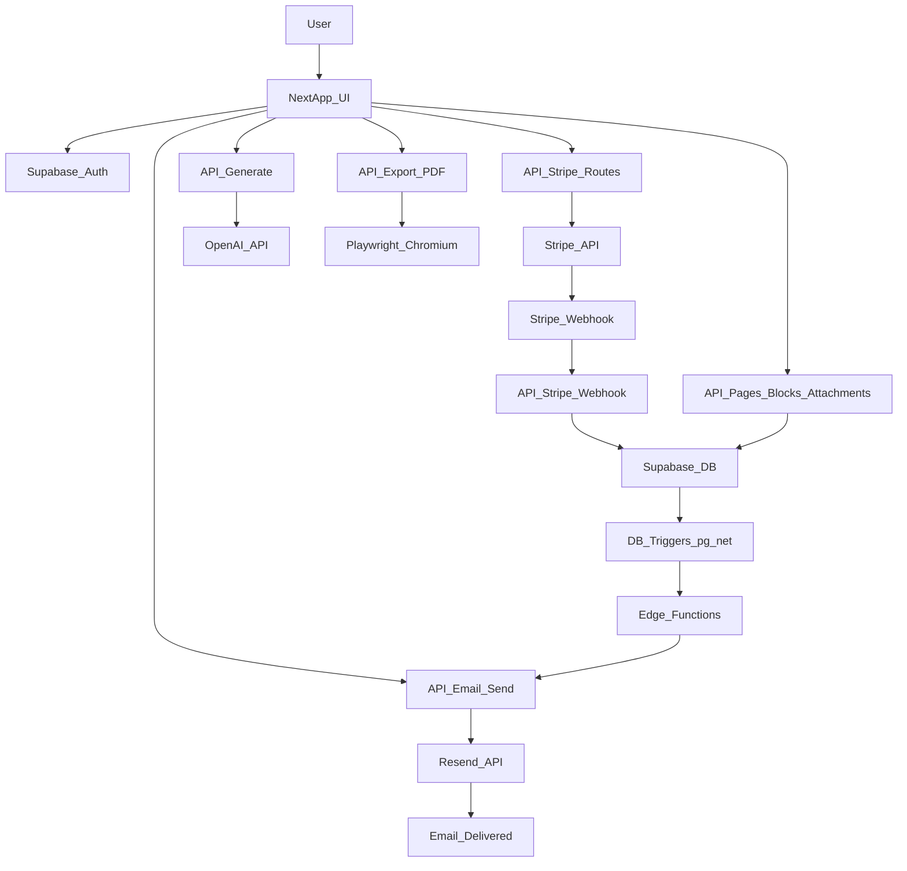
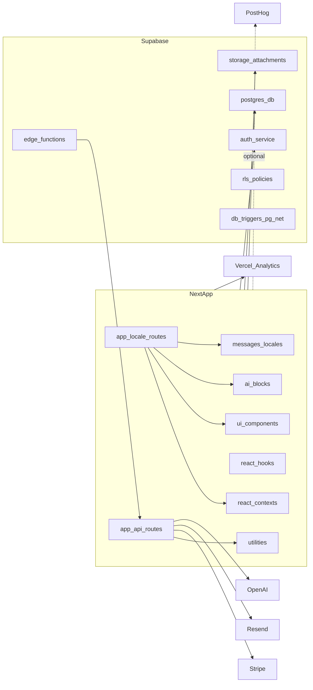

# Гайд по проєкту: поточний стан

Цей документ фіксує стан компонентів, логіки та інфраструктури на момент оновлення. Він не є інструкцією з розробки, а описує фактичну архітектуру, потоки даних, інтеграції та прогалини.

## Огляд системи

Проєкт — Next.js додаток з Supabase (Auth + Postgres + Edge Functions), Stripe для підписок, Resend для транзакційних листів, OpenAI для генерації контенту та Playwright для експорту PDF. Є багатомовність (next-intl), редактор сторінок з блоками (pages/blocks/attachments), AI-генерація блоків і експорт сторінок у PDF. Розгортання орієнтоване на Vercel, з RLS-політиками у базі та автоматизованими email-флоу через тригери.

## Інфраструктура та зовнішні сервіси

- **Next.js (App Router)** — UI + API routes у `app/`.
- **Supabase** — Auth, Postgres, RLS, Edge Functions, Storage (attachments), тригери через `pg_net`.
- **Stripe** — підписки, webhooks, керування статусом підписок.
- **Resend + React Email** — генерація та відправка листів.
- **OpenAI API** — генерація блоків контенту (GPT) у `/api/generate` та парсинг файлів у `/api/generate/parse`.
- **Playwright** — рендер сторінок для експорту PDF у `/api/export/pdf`.
- **next-intl** — локалізація (en, de, uk), маршрутизація за `[locale]`.
- **Vercel Analytics** — підключено у layout.
- **PostHog** — є утиліти, провайдер у layout може бути вимкнений.
- **MCP (Cursor)** — приклад конфігу в `.cursor/mcp.json.example`.

## ProcessDiagramm

## StructureDiagramm

## Локалізація (i18n)

- **next-intl** — middleware у `middleware.ts` з `localePrefix: 'always'`, matcher `/(en|de|uk)/:path*`.
- **Локалі** — `en`, `de`, `uk` (визначені в `i18n/config.ts`).
- **Повідомлення** — `messages/en.json`, `messages/de.json`, `messages/uk.json`.
- Усі публічні маршрути обгорнуті в `app/[locale]/`, сторінки та компоненти використовують `useTranslations` / `getTranslations`.

## Основні потоки логіки

### Auth

- OAuth callback обробляється в `app/auth/callback/route.ts`.
- Сесія встановлюється через `@supabase/ssr`, cookie-based.
- Гард маршрутів через `contexts/ProtectedRoute.tsx`.
- Контекст аутентифікації та sign-in/out у `contexts/AuthContext.tsx`.

### Підписки (Stripe ↔ Supabase)

- Webhook `/api/stripe/webhook` створює або оновлює записи в `subscriptions`.
- `/api/stripe/cancel` та `/api/stripe/reactivate` змінюють `cancel_at_period_end`.
- `/api/stripe/sync` синхронізує підписку з Stripe у Supabase.
- Хук `useSubscription` підтримує локальний кеш і realtime оновлення через Supabase channel.

### Сторінки та блоки (Pages / Blocks / Attachments)

- **Таблиці**: `pages` (title, slug, parent_page_id, owner_id), `blocks` (page_id, logical_id, type, content jsonb, position, version, created_by, is_deleted), `attachments` та Storage bucket для файлів.
- **Скрипти**: `supabase/scripts/setup/05-create-pages-table.sql`, `06-create-blocks-table.sql`, `07-create-attachments-table.sql`, `08-create-attachments-storage-policies.sql`.
- **API**:
  - `app/api/pages/route.ts` та `app/api/pages/[id]/route.ts` — CRUD сторінок.
  - `app/api/blocks/route.ts`, `app/api/blocks/[id]/route.ts`, `app/api/blocks/reorder/route.ts` — CRUD та зміна порядку блоків.
  - `app/api/attachments/route.ts`, `app/api/attachments/[id]/route.ts` — завантаження та видалення вкладень.
- **UI**: Редактор сторінки в `app/[locale]/pages/[slug]/page.tsx` — заголовок, тулбар (редагувати/зберегти/експорт/більше), список блоків з drag-and-drop (@dnd-kit), режими перегляду/редагування. Блоки рендеряться за типом; для складних типів використовуються компоненти з `components/ai-blocks/`.

### AI-генерація контенту

- **POST /api/generate** — приймає `page_id`, `language_code`, `selected_content_types`, `use_page_context`, `sources` (file/text), `page_context`, `user_preferences`. Використовує `OPENAI_API_KEY`, модель типу GPT. Підтримувані типи блоків: heading, paragraph, quote, callout, list, checklist, definitions, code, image, divider, table, timeline, steps, quiz, flashcard, flashcard_deck, faq, summary, takeaways, mermaid, graph. Повертає масив блоків для вставки на сторінку.
- **POST /api/generate/parse** — парсинг завантаженого файлу (наприклад PDF/docx) у текст для подальшої генерації; використовує бібліотеки типу pdf-parse, mammoth тощо.
- Для запису блоків клієнт використовує свіжий access token (через Supabase session), щоб уникнути 401 при записах.

### Експорт PDF

- **POST /api/export/pdf** — приймає `page_id`, `locale`. Авторизація через заголовок `Authorization: Bearer <token>`. Завантажує сторінку та блоки з Supabase, рендерить HTML (включаючи AI-блоки: таблиці, timeline, quiz, flashcard, mermaid, graph тощо) і конвертує в PDF через Playwright (chromium). Повертає PDF як stream.

### Email automation

- Таблиця `user_email_log` запобігає дублюванню листів.
- DB triggers (pg_net) викликають Edge Functions.
- Edge Functions викликають `/api/email/send` з internal API key.
- `services/emailService.ts` рендерить React Email шаблони та відправляє через Resend.

## Компоненти застосунку

### Сторінки (App Router)

- **Кореневі (без locale)** — `app/page.tsx`, `app/login/page.tsx`, `app/dashboard/page.tsx`, `app/pay/page.tsx`, `app/profile/page.tsx`, `app/preview-email/page.tsx`, `app/reset-password/page.tsx`, `app/update-password/page.tsx`, `app/verify-email/page.tsx` тощо.
- **Локалізовані** — `app/[locale]/page.tsx`, `app/[locale]/dashboard/page.tsx`, `app/[locale]/pages/[slug]/page.tsx` — лендінг, дашборд (Learner's Command Center), редактор/перегляд сторінки за slug.

### API routes

- `app/api/email/send/route.ts` — відправка листів, логування, dedupe.
- `app/api/stripe/webhook/route.ts` — обробка webhooks Stripe.
- `app/api/stripe/sync`, `cancel`, `reactivate`, `test/route.ts` — керування підпискою.
- `app/api/user/delete/route.ts` — soft-delete профілю та скасування підписки.
- `app/api/pages/route.ts`, `app/api/pages/[id]/route.ts` — CRUD сторінок.
- `app/api/blocks/route.ts`, `app/api/blocks/[id]/route.ts`, `app/api/blocks/reorder/route.ts` — CRUD та reorder блоків.
- `app/api/attachments/route.ts`, `app/api/attachments/[id]/route.ts` — вкладення.
- `app/api/generate/route.ts` — генерація блоків (OpenAI).
- `app/api/generate/parse/route.ts` — парсинг файлів у текст.
- `app/api/export/pdf/route.ts` — експорт сторінки в PDF.

### Контексти

- `contexts/AuthContext.tsx` — сесія, sign-in/out, статус підписки.
- `contexts/ProtectedRoute.tsx` — редірект неавторизованих.
- `contexts/LayoutContext.tsx` — стан layout/sidebar.
- `contexts/PostHogContext.tsx` — аналітика (опційно в layout).

### Компоненти UI

- **Загальні**: TopBar, AppSidebar, WorkspaceShell, PricingSection, StripeBuyButton, SubscriptionStatus, LoginForm, ForgotPasswordModal, LoadingSpinner, OnboardingTour, LanguagePicker, AccountManagement, MetricCard, VideoModal, TypewriterEffect тощо.
- **AI-блоки** (рендер і/або редагування): `components/ai-blocks/TableBlock.tsx`, `TimelineBlock.tsx`, `QuizBlock.tsx`, `FlashcardBlock.tsx`, `MermaidBlock.tsx`, `GraphBlock.tsx`. Використовуються на сторінці `[locale]/pages/[slug]` та в експорті PDF.

### Хуки

- `hooks/useSubscription.ts` — статус підписки, realtime, sync.
- `hooks/useTrialStatus.ts` — логіка trial (наприклад 48 год).

### Утиліти

- `utils/supabase.ts` — клієнт з anon key.
- `utils/supabase-admin.ts` — service role для server-side.
- `utils/slug.ts` — генерація/нормалізація slug.
- `utils/cors.ts`, `utils/env.ts`, `utils/posthog.ts`, `utils/analytics.ts`.

### Email templates

- `emails/templates/`: Welcome, BillingConfirmation, Cancellation + спільні компоненти (EmailLayout, Button тощо).

## Дані та схеми

- **Базові таблиці** (з `initial_supabase_table_schema.sql`): `users`, `user_preferences`, `user_trials`, `subscriptions` + RLS.
- **Контент**: `pages`, `blocks`, `attachments` + Storage — створюються скриптами в `supabase/scripts/setup/` (05–08).
- **Тригери та Edge Functions**: `01-enable-pg-net-extension.sql`, `02-create-user-email-log-table.sql`, `03-create-public-users-trigger.sql`, `04-create-billing-cancellation-triggers.sql`; функції в `supabase/functions/` (send-welcome-email, send-billing-email, send-cancellation-email).

## Конфіг та змінні середовища

- **.env.example**: NEXT_PUBLIC_APP_URL, NEXT_PUBLIC_API_URL, NEXT_PUBLIC_WS_URL, Supabase URL/keys, **OPENAI_API_KEY**, Stripe keys, Resend, INTERNAL_API_KEY, PostHog. OPENAI використовується в `app/api/generate/route.ts`.
- `utils/env.ts` перевіряє обов’язкові змінні для runtime.

## Що вже є

- Auth (Supabase), RLS, базові таблиці та таблиці pages/blocks/attachments.
- Stripe subscriptions, webhooks, керування підпискою.
- Автоматичні emails через тригери, Edge Functions, Resend.
- Багатомовність (next-intl, en/de/uk).
- Редактор сторінок з блоками, DnD, режими перегляду/редагування.
- AI-генерація блоків (OpenAI) та парсинг файлів.
- Експорт сторінки в PDF (Playwright).
- Дашборд у стилі «Learner's Command Center» (bento-grid, метрики навчання).
- Vercel Analytics; PostHog опційно.

## Чого немає (станом на зараз)

- CI/CD (GitHub Actions).
- Контейнеризація (Dockerfile/compose).
- Повноцінна observability (Sentry/OTel/Datadog).
- Rate-limit, черги, фонова обробка завдань.
- Інструмент міграцій (лише SQL-скрипти в `supabase/scripts/setup/`).

## Ризики / прогалини

- PostHog може бути вимкнений у `app/layout.tsx`.
- `config/api.ts` може описувати зовнішній API/WS — перевірити актуальність використання.
- OPENAI_API_KEY обов’язковий для `/api/generate`; без нього генерація не працює.

## Посилання на ключові файли

- `app/layout.tsx`, `app/[locale]/layout.tsx`
- `app/[locale]/dashboard/page.tsx`, `app/[locale]/pages/[slug]/page.tsx`
- `app/api/stripe/*`, `app/api/email/send/route.ts`
- `app/api/pages/*`, `app/api/blocks/*`, `app/api/attachments/*`
- `app/api/generate/route.ts`, `app/api/generate/parse/route.ts`, `app/api/export/pdf/route.ts`
- `contexts/AuthContext.tsx`, `contexts/ProtectedRoute.tsx`
- `utils/supabase.ts`, `utils/supabase-admin.ts`, `services/emailService.ts`
- `components/ai-blocks/*`
- `i18n/config.ts`, `middleware.ts`, `messages/*.json`
- `supabase/scripts/setup/*`, `supabase/functions/*`
