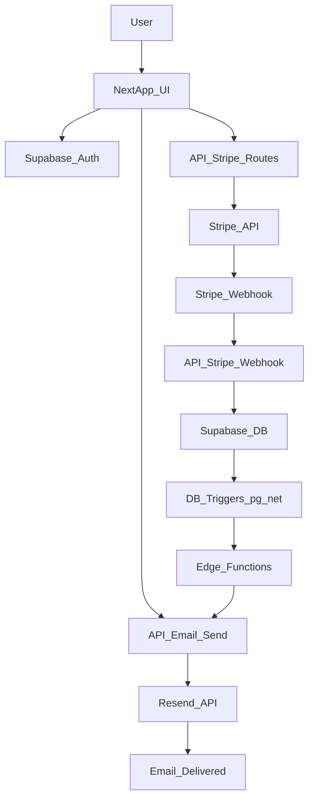
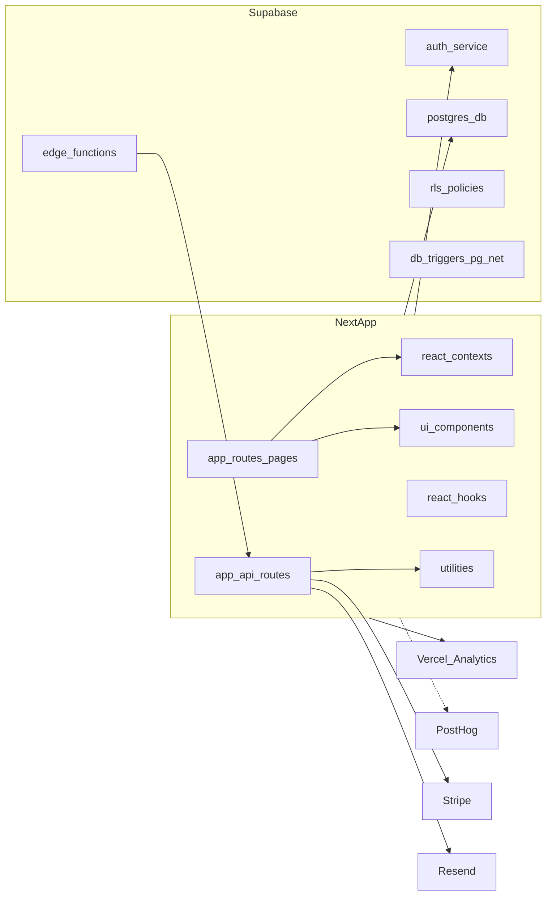

# Гайд по проєкту: поточний стан

Цей документ фіксує стан компонентів, логіки та інфраструктури на момент створення. Він не є інструкцією з розробки, а описує фактичну архітектуру, потоки даних, інтеграції та прогалини.

## Огляд системи
Проєкт — Next.js додаток з Supabase (Auth + Postgres + Edge Functions), Stripe для підписок та Resend для транзакційних листів. Розгортання орієнтоване на Vercel, з RLS‑політиками у базі та автоматизованими email‑флоу через тригери.

## Інфраструктура та зовнішні сервіси
- **Next.js (App Router)**: UI + API routes у `app/`.
- **Supabase**: Auth, Postgres, RLS, Edge Functions, тригери через `pg_net`.
- **Stripe**: підписки, webhooks, керування статусом підписок.
- **Resend + React Email**: генерація та відправка листів.
- **Vercel Analytics**: підключено у layout.
- **PostHog**: є утиліти, але провайдер у layout закоментований.
- **MCP (Cursor)**: приклад конфігу в `.cursor/mcp.json.example`.

## ProcessDiagramm

## StructureDiagramm

## Основні потоки логіки

### Auth
- OAuth callback обробляється в `app/auth/callback/route.ts`.
- Сесія встановлюється через `@supabase/ssr`, cookie‑based.
- Гард маршрутів через `contexts/ProtectedRoute.tsx`.
- Контекст аутентифікації і обробка sign‑in/out в `contexts/AuthContext.tsx`.

### Підписки (Stripe ↔ Supabase)
- Webhook `/api/stripe/webhook` створює або оновлює записи в `subscriptions`.
- `/api/stripe/cancel` та `/api/stripe/reactivate` змінюють `cancel_at_period_end`.
- `/api/stripe/sync` синхронізує підписку з Stripe у Supabase.
- Хук `useSubscription` підтримує локальний кеш і realtime оновлення через Supabase channel.

### Email automation
- Таблиця `user_email_log` запобігає дублюванню листів.
- DB triggers (pg_net) викликають Edge Functions.
- Edge Functions викликають `/api/email/send` з internal API key.
- `emailService.ts` рендерить React Email шаблони та відправляє через Resend.

## Компоненти застосунку

### Сторінки (App Router)
`app/` містить сторінки:
- `page.tsx` (landing), `dashboard/page.tsx`, `profile/page.tsx`, `pay/page.tsx`
- `login/page.tsx`, `verify-email/page.tsx`, `reset-password/page.tsx`, `update-password/page.tsx`
- `preview-email/page.tsx` для перегляду шаблонів листів

### API routes
`app/api/`:
- `email/send/route.ts` — відправка листів + логування + dedupe.
- `stripe/webhook/route.ts` — обробка webhooks Stripe.
- `stripe/sync|cancel|reactivate|test/route.ts` — керування підпискою.
- `user/delete/route.ts` — soft‑delete профілю + cancel підписки.

### Контексти
`contexts/`:
- `AuthContext.tsx` — сесія, sign‑in/out, статус підписки.
- `ProtectedRoute.tsx` — редірект неавторизованих.
- `PostHogContext.tsx` — провайдер аналітики (не підключено у layout).

### Компоненти UI
`components/`: TopBar, PricingSection, StripeBuyButton, SubscriptionStatus, LoginForm, LoadingSpinner, OnboardingTour тощо.

### Хуки
`hooks/`:
- `useSubscription.ts` — статус підписки, realtime updates, sync.
- `useTrialStatus.ts` — логіка 48‑годинного trial.

### Утиліти
`utils/`:
- `supabase.ts` — клієнт з anon key.
- `supabase-admin.ts` — service role клієнт для server‑side операцій.
- `cors.ts` — CORS wrapper.
- `env.ts` — перевірка обовʼязкових змінних.
- `posthog.ts`, `analytics.ts` — аналітика.

### Email templates
`emails/templates/`: Welcome, BillingConfirmation, Cancellation + спільні компоненти layout.

## Дані та схеми
Файл `initial_supabase_table_schema.sql` містить таблиці:
- `users`, `user_preferences`, `user_trials`, `subscriptions`
та RLS‑політики для користувачів і service_role.

### Тригери та Edge Functions
`supabase/scripts/setup/`:
- `01-enable-pg-net-extension.sql` — `pg_net` для HTTP викликів.
- `02-create-user-email-log-table.sql` — `user_email_log`.
- `03-create-public-users-trigger.sql` — welcome email.
- `04-create-billing-cancellation-triggers.sql` — billing/cancellation.

`supabase/functions/`:
- `send-welcome-email`, `send-billing-email`, `send-cancellation-email`.

## Конфіг та змінні середовища
`.env.example`:
- Supabase URL/keys, Stripe keys, Resend, PostHog, APP_URL.
`utils/env.ts` перевіряє обовʼязкові змінні для runtime.

## Що вже є
- Auth (Supabase), RLS, базові таблиці.
- Stripe subscriptions + webhook‑обробка.
- Автоматичні emails через тригери/Edge Functions/Resend.
- Vercel Analytics (підключено).
- UI + сторінки для onboarding, профілю, підписки.

## Чого немає (станом на зараз)
- CI/CD конфігурації (GitHub Actions).
- Контейнеризації (Dockerfile/compose).
- Observability (Sentry/OTel/Datadog).
- Rate‑limit, cache/черги, фонова обробка.
- Інструмент міграцій (Prisma/Migrate) — лише SQL‑скрипти.

## Ризики/прогалини
- PostHog присутній у коді, але не активований у `app/layout.tsx`.
- `config/api.ts` описує зовнішній API/WS, але використань у коді не знайдено.
- В `.env.example` є `OPENAI_API_KEY`, але в коді немає використання та залежності у `package.json`.

## Посилання на ключові файли
- `app/layout.tsx`
- `app/api/stripe/*`
- `app/api/email/send/route.ts`
- `contexts/AuthContext.tsx`
- `utils/supabase.ts`, `utils/supabase-admin.ts`
- `services/emailService.ts`
- `supabase/scripts/setup/*`
- `supabase/functions/*`
